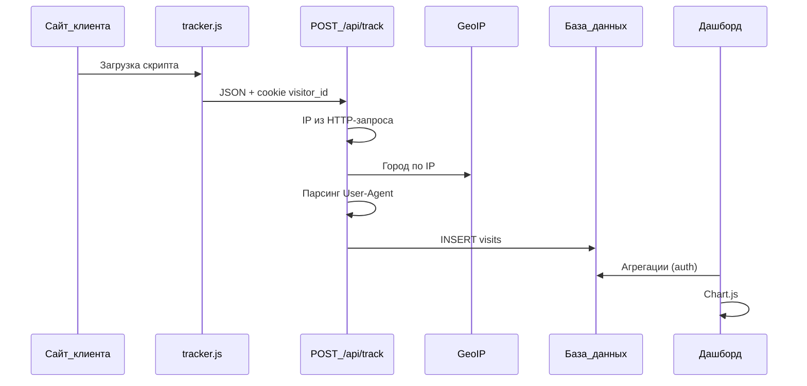

# Счётчик посещений

Веб-аналитика для одного сайта: встраиваемый JS-трекер собирает визиты, Laravel-сервер обогащает данные (IP, город, устройство) и сохраняет в БД. Защищённый дашборд показывает графики по часам и распределение по городам.

## Идея

Классические счётчики (LiveInternet, Яндекс.Метрика) тяжёлые и закрытые. Этот проект — **минималистичная альтернатива**:

1. На любую HTML-страницу подключается один скрипт `tracker.js`.
2. Браузер отправляет контекст страницы на ваш сервер.
3. Сервер дополняет запись геолокацией и типом устройства.
4. Владелец смотрит статистику в личном кабинете после входа.

Разделение ответственности: **клиент** не знает IP и город (их нельзя надёжно получить в JS на чужом домене), **сервер** не доверяет клиенту в вопросах геолокации и парсит User-Agent сам.

## Возможности

- Встраиваемый трекер без сборки (один файл `public/tracker.js`)
- API приёма визитов с rate limiting и CORS
- Определение города по IP (GeoIP)
- Классификация устройства: mobile / tablet / desktop
- Уникальные посетители через cookie `visitor_id`
- Дашборд с авторизацией (Laravel Breeze)
- График уникальных визитов по часам (горизонтальные столбцы)
- Круговая диаграмма по городам
- Фильтр периода: 7 или 30 дней

## Технологический стек

| Слой | Технологии |
|------|------------|
| Backend | PHP 8.4, Laravel 13 |
| База данных | PostgreSQL |
| Авторизация | Laravel Breeze (Blade) |
| Frontend дашборда | Blade, Tailwind CSS, Alpine.js, Vite |
| Графики | Chart.js (CDN) |
| GeoIP | [stevebauman/location](https://github.com/Stevebauman/location) (IpApi и fallback-драйверы) |
| Клиентский трекер | Vanilla JavaScript (IIFE, без зависимостей) |

## Архитектура



## Алгоритмы и логика

### Идентификация посетителя

1. При первом визите сервер генерирует UUID и отдаёт cookie `visitor_id` (срок — 1 год).
2. При повторных запросах UUID читается из cookie (`credentials: 'include'` в `fetch`).
3. **Уникальный посетитель** в отчётах — это `COUNT(DISTINCT visitor_id)`, а не количество строк.

### Обогащение данных на сервере

| Поле | Источник |
|------|----------|
| `ip_address` | `$request->ip()` |
| `city`, `country` | GeoIP по IP (`VisitGeoService`); для локальных IP — `Local` |
| `device_type`, `browser`, `os` | Парсинг User-Agent (`UserAgentParser`) |
| `page_url`, `referrer`, экран, язык, timezone | JSON от `tracker.js` |

### Агрегации для дашборда

**По часам** (SQLite):

```sql
strftime('%Y-%m-%d %H:00', visited_at) AS hour_label
COUNT(DISTINCT visitor_id) AS unique_visits
GROUP BY hour_label
```

**По городам:**

```sql
GROUP BY city
COUNT(DISTINCT visitor_id)
ORDER BY unique_visits DESC
```

На оси **X** графика по часам — количество уникальных визитов, на оси **Y** — метка времени (`indexAxis: 'y'` в Chart.js).

### Защита API

- `throttle:60,1` — не более 60 запросов в минуту с одного IP
- CORS настроен в `config/cors.php` (`supports_credentials: true` для cookie)
- Ошибки трекера на клиентском сайте подавляются (не ломают страницу хоста)

## Структура проекта

```
app/
  Http/Controllers/
    Api/TrackController.php      # Приём визитов
    DashboardController.php      # Статистика и JSON для графиков
  Models/Visit.php
  Services/
    VisitGeoService.php          # GeoIP
    UserAgentParser.php          # Устройство и браузер
public/
  tracker.js                     # Встраиваемый скрипт
  demo.html                      # Страница для проверки
resources/views/dashboard/       # Дашборд
routes/
  api.php                        # POST /api/track
  web.php                        # /dashboard, авторизация
database/migrations/             # users, sessions, visits
config/
  cors.php
  tracker.php                    # Настройки cookie трекера
```

### Учётные данные по умолчанию

После `db:seed` (см. `AdminUserSeeder`):

| Поле | Значение |
|------|----------|
| Email | `admin@example.com` |
| Пароль | `password` |

Настраивается через `.env`: `ADMIN_EMAIL`, `ADMIN_PASSWORD`.

### Проверка

| URL | Описание |
|-----|----------|
| http://127.0.0.1:8000/demo.html | Демо-страница с трекером |
| http://127.0.0.1:8000/login | Вход |
| http://127.0.0.1:8000/dashboard | Статистика |

## Подключение трекера

На сайт, который нужно отслеживать:

```html
<script
  src="https://ВАШ-ДОМЕН/tracker.js"
  data-api="https://ВАШ-ДОМЕН"
  async
></script>
```

- `src` — откуда загружается скрипт (обычно ваш Laravel-сервер).
- `data-api` — базовый URL API (обязателен при кросс-доменном подключении).
- Если скрипт и API на одном домене, `data-api` можно не указывать.

## API

### `POST /api/track`

Принимает JSON, отвечает `204 No Content`, выставляет cookie `visitor_id`.

**Тело запроса:**

| Поле | Тип | Обязательное |
|------|-----|--------------|
| `page_url` | string (URL) | да |
| `referrer` | string | нет |
| `screen_width` | integer | нет |
| `screen_height` | integer | нет |
| `language` | string | нет |
| `timezone` | string | нет |
| `user_agent` | string | нет |

### Дашборд (требуется авторизация)

| Метод | URL | Описание |
|-------|-----|----------|
| GET | `/dashboard` | HTML-страница статистики |
| GET | `/dashboard/data/hourly?days=7` | JSON для графика по часам |
| GET | `/dashboard/data/cities?days=7` | JSON для диаграммы городов |

Параметр `days`: `7` или `30`.

## Конфигурация

Ключевые переменные `.env`:

```env
APP_URL=http://localhost

DB_CONNECTION=sqlite

ADMIN_EMAIL=admin@example.com
ADMIN_PASSWORD=password

# CORS: * или конкретный домен сайта с трекером
TRACKER_ALLOWED_ORIGIN=*

# Cookie для кросс-доменного трекера (production + HTTPS)
TRACKER_COOKIE_SECURE=false
TRACKER_COOKIE_SAMESITE=lax
```
